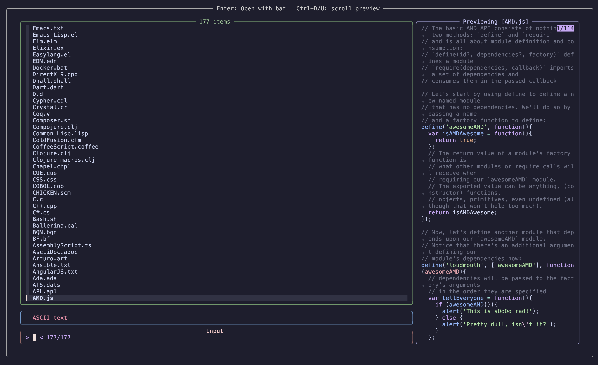
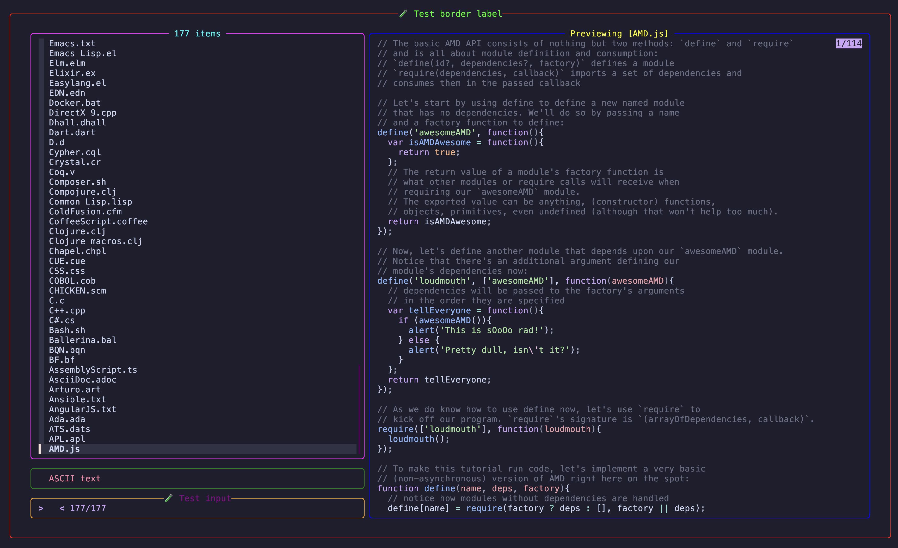

#### 🎨 Theming in Lexy (from v0.4.2)

Starting from **Lexy v0.4.2**, you can customize the appearance of the `fzf` interface used in the `lexy list` command.

By default, Lexy applies a color palette inspired by **Catppuccin Mocha**, but you can override it by creating a `config.toml` file in your Lexy config directory:

If you want to modify syntax highlighting for file previews powered by `bat`, refer to the [bat documentation](https://github.com/sharkdp/bat).

---

##### 🛠 Default Configuration

```toml
[fzf]
preview_percent = "60"
input_label = " Input "
border_label = " Enter: Open with bat │ Ctrl-D/U: scroll preview "

[colors]
border = "#aaaaaa"
label = "#cccccc"
preview_border = "#9999cc"
preview_label = "#ccccff"
list_border = "#669966"
list_label = "#99cc99"
input_border = "#996666"
input_label = "#ffcccc"
header_border = "#6699cc"
```

- `preview_percent` changes the size of the file preview window
- `input_label` changes the text of the input label
- `border_label` changes the text of the top of the window





Below is the configuration used in the second screenshot:

```toml
[colors]
border = "#ff0000"         # Red
label = "#00ff00"          # Green
preview_border = "#0000ff" # Blue
preview_label = "#ffff00"  # Yellow
list_border = "#ff00ff"    # Magenta
list_label = "#00ffff"     # Cyan
input_border = "#ffa500"   # Orange
input_label = "#800080"    # Lila
header_border = "#008000"  # Dark green
```

You can include only the parameters you'd like to override, Lexy will fall back to defaults for the rest.
